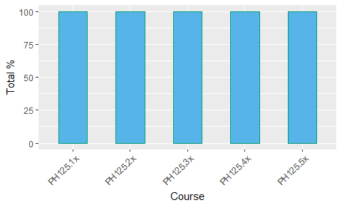

Progress Report
================
D Garrett
2018-07-01

Introduction
------------

This report summarises my progress on the HarvardX Data Science programme.

Programme overview
------------------

This [edX](www.edx.org) programme covers key knowledge and skills for real-world data science tasks, using the R language and environment for statistical computing. I've completed the materials and assessments for five of the nine courses (the sixth begins shortly):

1.  'R Basics'  
    An introduction to working with data using R.

2.  'Visualization'  
    Fundamentals of data visualisation and exploratory analysis. Introduces distributions and the normal distribution, as well as a range of representations, from basic histograms, smooth densities, Q-Q and box plots, to more sophisticated graphics using ggplot2. Concludes with a case study illustrating the power of effective data visualisation, and some broad principles for this.

3.  'Probability'  
    Important concepts in probability theory, including principles for discrete and continuous data, (non-)independent events, sampling models and the Central Limit Theorem, as well as running simple Monte Carlo simulations.

4.  'Inference and Modeling'  
    Key concepts such as estimates, confidence intervals and p-values, and applications of probability theory including basics of Bayesian statistics and data-driven approaches in predictive modelling.

5.  'Productivity Tools'  
    An introduction to RStudio features, elementary use of the Unix command line for filesystem management, version control with Git and GitHub, and report creation with R Markdown.

Progress summary
----------------

My average course total for the five so far, is: 100%.

### Totals by course

| Total % | Course   | Title                    |
|:-------:|:---------|:-------------------------|
|   100   | PH125.1x | 'R Basics'               |
|   100   | PH125.2x | 'Visualization'          |
|   100   | PH125.3x | 'Probability'            |
|   100   | PH125.4x | 'Inference and Modeling' |
|   100   | PH125.5x | 'Productivity Tools'     |

